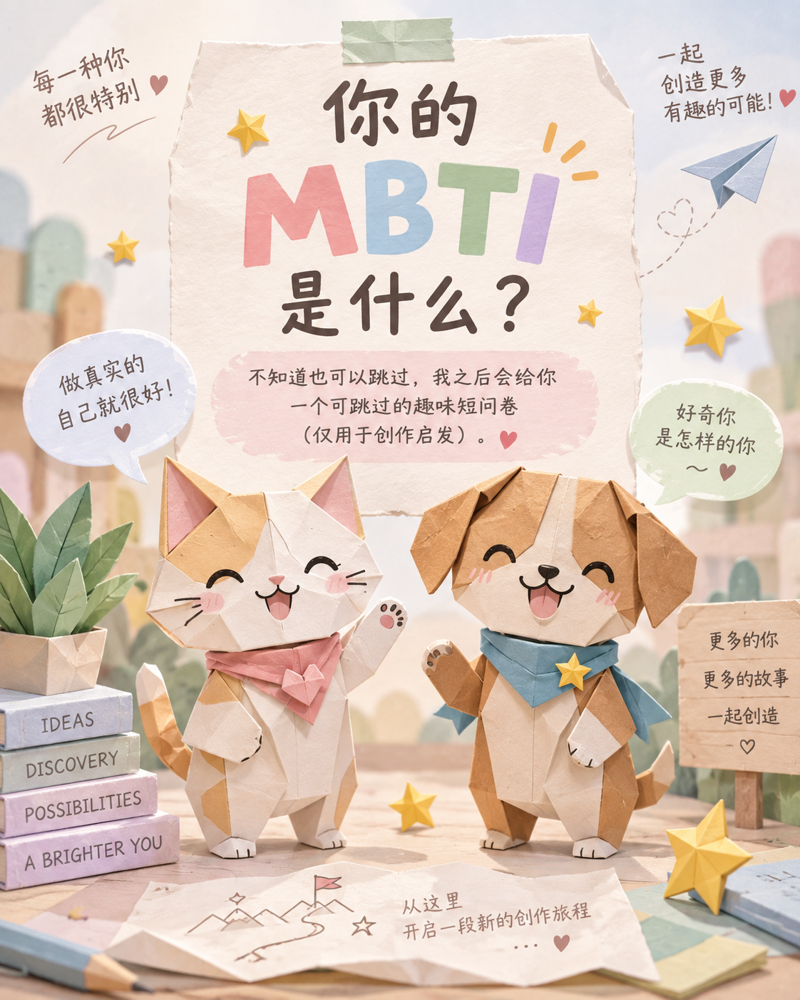

# Cat Swapper

[English](README.md) | **中文**



**根据你的 MBTI 与个人经历，共创一个代表自己的折纸猫狗“另一个自己”；也可以把现有壁纸中的宠物替换成原始照片里的真实宠物。**

Cat Swapper 是一个开放的 [Agent Skills](https://agentskills.io/specification) 包。首页主体验是人格驱动的折纸角色共创，另外三个同级 Skill 用于真实宠物换图。

> **重要说明：**本仓库只包含工作流、提示词和一张画风参考素材，不提供图片模型、API 密钥或付费调用授权。安装 Skill 不等于授权生成图片。

## 主 Skill：`mbti-origami-pet`

[`mbti-origami-pet`](skills/mbti-origami-pet/SKILL.md)根据 MBTI 和已授权且实际可访问的个人历史，共创一个像是“另一个自己”的折纸猫或狗。

它每次只问一个问题，用温柔的“回忆时光机”口吻回望两到三个有出处的个人片段，再推荐三个外形差异清楚的品种。随后给出两套角色方案，标题直接呈现完整场景，让用户一眼看懂选择。场景名称由“具体场景＋可见动作＋现实中存在的理想职业”组成，不把职业原型冒充成用户真实履历。

用户选定方案后，Skill 只生成一张图片，零自动重试。技术质量、是否喜欢和“是否像自己”分别判断。

只安装主 Skill：

```bash
npx -y skills add RuntianLee/cat-swapper -g --skill mbti-origami-pet -y
```

调用示例：

```text
使用 $mbti-origami-pet，根据我的 MBTI 和当前对话中可访问的个人历史，共创一个折纸猫或狗“另一个自己”。
```

内置的[画风参考图](skills/mbti-origami-pet/assets/README.md)只约束大几何折面、独立纸偶构件、哑光纸纤维和纸艺微缩布景；其中的文字、版式、配色、配饰、姿势和具体构图都不是模板。

## 真实宠物换图 Skills

### `cat-swapper`

[`cat-swapper`](skills/cat-swapper/SKILL.md)可以替换一只猫、一次生成多只已明确映射的猫，或通过无猫底图和本地分层合成制作多猫壁纸。它只把原始照片作为身份依据，并将技术 QC、主人身份判断和整体审美接受分开记录。

```bash
npx -y skills add RuntianLee/cat-swapper -g --skill cat-swapper -y
```

```text
使用 $cat-swapper。图1是基础猫壁纸，后续图片是同一只目标猫的原始照片，生成一张结果。
```

### `dog-swapper`

[`dog-swapper`](skills/dog-swapper/SKILL.md)把现有图片中的一只狗替换成一张或多张原始参考照片里的同一只目标狗，同时按工作流能力尽量保留基础图的场景、构图、姿势、机位和非狗内容。

```bash
npx -y skills add RuntianLee/cat-swapper -g --skill dog-swapper -y
```

```text
使用 $dog-swapper。图1是基础狗壁纸，后续图片是同一只目标狗的原始照片，生成一张结果。
```

### `pet-swapper`

[`pet-swapper`](skills/pet-swapper/SKILL.md)用于尚未选择猫或狗的宠物换图请求。它会分流到 `cat-swapper` 或 `dog-swapper`，因此需要同时安装三个换图 Skill：

```bash
npx -y skills add RuntianLee/cat-swapper -g --skill pet-swapper cat-swapper dog-swapper -y
```

```text
使用 $pet-swapper，根据我的基础图和宠物原始照片选择猫咪或狗狗工作流。
```

用户明确选择猫咪或狗狗时优先遵循。混合物种和跨物种替换不在适用范围内。

## 安装全部 Skill

一次安装四个入口：

```bash
npx -y skills add RuntianLee/cat-swapper -g --all
```

手动安装时，把 `skills/` 下需要的目录并列复制到平台的 Skill 目录。

## 多猫工作流

| 模式 | 适合场景 | 方法 |
| --- | --- | --- |
| [分层多猫](skills/cat-swapper/references/layered-multi-cat.md) | 猫位可以独立裁出，身份隔离和背景保持优先 | 先生成无猫底图，再逐猫生成局部小图、本地抠像，最后按固定坐标合成；逐猫复用单猫提示词。 |
| [一次性多猫直出](skills/cat-swapper/references/multi-cat.md) | 猫之间有接触、遮挡、共享阴影或道具，或者必须单次生成 | 把每个基础猫位与一个身份参考组一一对应，并使用专用多猫提示词。 |

画面结构允许时优先使用分层流程。无法拆成独立透明层的复杂互动仍需要一次性多猫提示词。

```text
使用 $cat-swapper 的分层多猫模式。先完成零调用预检，冻结画布、猫位、身份参考分组、请求上限和成本上限；未经我确认不要调用图片 API。
```

## 输入与执行边界

- 换图流程中的图 1 是唯一基础图，提供场景、构图、姿势、表情、机位和空间关系。
- 身份参考必须是明确归属到一只目标宠物的原始照片；生成图和合成图不能作为身份参考。
- 多猫参考必须分成互不重叠的身份组，并与基础猫位建立一对一映射。
- 每次外部模型调用都需要当前授权。默认只生成一张、零自动重试；不得静默增加请求、切换模型或提高成本。
- 技术 QC、主人身份判断和整体审美接受必须分开记录。
- MBTI 共创只使用已授权且可访问的历史与记忆，不声称覆盖完整账号，并将技术 QC、喜欢程度和“像自己”分开记录。
- 文本提示词不能保证非宠物区域逐像素不变；有硬性要求时使用分层流程，并验证全部 alpha 并集之外的像素。

## 验证

```bash
./scripts/check.sh
```

检查脚本会验证必需文件、模式引用、双语 README 互链、提示词哈希和画风参考图哈希。

| 提示词 | SHA-256 |
| --- | --- |
| [单猫／分层逐猫](skills/cat-swapper/prompt.txt) | `c4a5bc29660791242df2c49fbda6576208baaaea00e94fca12fd4efc008dbe96` |
| [一次性多猫直出](skills/cat-swapper/prompt-multi.txt) | `23bb0b2a20d751a8eb83a414247cf2be1b6dc92aa2fc7ef625c902b33751c554` |
| [单狗](skills/dog-swapper/prompt.txt) | `a354867f9b97a48dc7f3457204b6d672e3b62bd80f6f528482ef71ffd79f3fb6` |

## 已知限制

- 一个猫位可分离的七猫分层案例获得主人整体接受并通过合成完整性检查，但严格姿势／表情 QC 没有整体通过；这不能证明跨壁纸稳定或无损毛发抠像。
- 该案例中的一次性多猫提示词没有形成获接受的终态。
- 狗狗流程尚未完成真实模型和主人身份判断验证。
- MBTI 折纸流程已有多轮单用户交互证据，尚未完成跨用户或跨模型验证。
- 私人照片、运行账本、授权记录、mask 和生成结果不进入本公开仓库。

## 许可证

代码和文本采用 MIT 许可证，见 [LICENSE](LICENSE)。折纸[画风参考图](skills/mbti-origami-pet/assets/README.md)的著作权仍归原权利人，不随 MIT 许可证重新授权。
